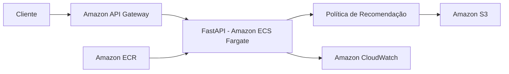

# FIAP Datathon — Machine Learning Engineering

Projeto desenvolvido para o Datathon da Pós-Tech em Machine Learning Engineering da FIAP.

## Sobre o projeto

O objetivo deste projeto é construir uma solução adaptativa para apoiar decisões de abordagem em campanhas de marketing bancário.

A partir do histórico disponível, a política escolhe entre dois canais de contato:

- `cellular`
- `telephone`

A recompensa utilizada é binária e indica se houve conversão do cliente.

A solução compara uma política fixa, utilizada como baseline, com uma política adaptativa baseada em Thompson Sampling.

---

## Problema de negócio

Em campanhas de marketing, utilizar sempre a mesma estratégia de contato pode não ser a melhor decisão para todos os clientes.

A proposta deste projeto é utilizar uma política adaptativa capaz de aprender com o histórico das interações e recomendar o canal com maior recompensa esperada para cada contexto.

Neste trabalho:

- os braços da política são os canais `cellular` e `telephone`;
- a recompensa é a conversão do cliente;
- o contexto final selecionado foi `previous_group`, derivado da quantidade de contatos realizados em campanhas anteriores.

O contexto foi dividido em:

- `none`: nenhum contato anterior;
- `one`: um contato anterior;
- `two_plus`: dois ou mais contatos anteriores.

---

## Dataset

O projeto utiliza a base pública **Bank Marketing**, disponibilizada no Kaggle:

https://www.kaggle.com/datasets/henriqueyamahata/bank-marketing

Foi utilizada a versão:

```text
bank-additional-full.csv
```

A base contém informações relacionadas a campanhas de marketing de uma instituição bancária portuguesa e possui como variável alvo `y`, que indica se o cliente realizou ou não a assinatura de um depósito a prazo.

A versão utilizada contém **41.188 registros** antes do pré-processamento.

A análise exploratória está disponível em:

```text
notebooks/01_eda.ipynb
```

---

## Preparação dos dados

O pré-processamento está disponível em:

```text
notebooks/02_preprocessing.ipynb
```

Os principais tratamentos realizados foram:

- remoção de 12 registros completamente duplicados;
- preservação da ordem original das interações por meio de `interaction_id`;
- remoção da variável `duration` para evitar vazamento de informação;
- transformação da variável alvo `y` em uma recompensa binária;
- utilização de `contact` para definir os braços `cellular` e `telephone`;
- tratamento da variável `pdays`;
- preservação dos valores `unknown` como categorias explícitas;
- criação da variável `age_group`;
- geração da base processada utilizada nos experimentos.

Após o tratamento, a base ficou com **41.176 registros**.

### Remoção de `duration`

A variável `duration` representa a duração da ligação.

Ela não é utilizada pela solução porque essa informação só é conhecida depois que o contato com o cliente já aconteceu. Utilizá-la para decidir qual canal deve ser escolhido introduziria vazamento de informação.

---

## Baseline e Thompson Sampling

Os experimentos estão disponíveis em:

```text
notebooks/03_bandit_experiments.ipynb
```

### Baseline

O baseline utiliza uma regra determinística simples:

> selecionar sempre o braço que apresentou a maior taxa de conversão no histórico disponível.

No conjunto utilizado para definição da política, o braço selecionado foi `cellular`.

### Thompson Sampling

A política adaptativa utiliza Thompson Sampling com uma abordagem Beta-Bernoulli.

O prior utilizado é:

```text
Beta(1, 1)
```

Para cada combinação de contexto e braço, são mantidos os parâmetros `alpha` e `beta`, atualizados conforme sucessos e fracassos observados.

A avaliação utiliza replay offline. Uma recompensa só é considerada quando a ação escolhida pela política coincide com a ação registrada historicamente.

---

## Seleção do contexto

Para evitar utilizar o conjunto de teste durante decisões de modelagem, a base foi dividida temporalmente em:

```text
60% treino
20% validação
20% teste
```

Durante a validação foram comparados os seguintes contextos:

- `age_group`;
- `poutcome`;
- `age_group + poutcome`;
- `previous_group`.

O contexto `previous_group` apresentou o melhor resultado médio entre as alternativas que atendiam ao critério mínimo de cobertura e foi utilizado na avaliação final.

---

## Resultados

A avaliação final foi realizada sobre os 20% finais da base, preservando a ordem das interações.

| Política | Taxa de conversão | Cobertura do replay | Interações avaliadas |
| --- | ---: | ---: | ---: |
| Baseline | 32,18% | 87,96% | 7.244 |
| Thompson Sampling | 33,12% | 82,75% | 6.815 |

No experimento principal, o Thompson Sampling apresentou:

- ganho absoluto de aproximadamente **0,94 ponto percentual**;
- ganho relativo de aproximadamente **2,92%** em relação ao baseline.

Como Thompson Sampling é uma política estocástica, também foram realizadas 30 execuções com diferentes seeds.

Os resultados médios foram:

```text
Taxa média de conversão: 32,42%
Desvio padrão: 0,77 p.p.
Cobertura média: 81,87%
```

Os resultados devem ser interpretados considerando as limitações do replay offline e a diferença de cobertura entre as políticas.

---

## Golden Set

A avaliação individual dos casos está disponível em:

```text
notebooks/04_evaluation_golden_set.ipynb
```

O Golden Set contém 5 exemplos reais do conjunto de teste, distribuídos entre os contextos `none`, `one` e `two_plus`.

Para cada cliente são apresentadas:

- informações do contexto;
- estimativa posterior para `cellular`;
- estimativa posterior para `telephone`;
- canal recomendado;
- análise da decisão.

No Golden Set, a recomendação utiliza a maior média posterior de cada braço para manter os exemplos determinísticos e reproduzíveis.

---

## Estrutura do projeto

```text
fiap-datathon-mlet/
├── data/
│   ├── raw/
│   └── processed/
├── notebooks/
│   ├── 01_eda.ipynb
│   ├── 02_preprocessing.ipynb
│   ├── 03_bandit_experiments.ipynb
│   └── 04_evaluation_golden_set.ipynb
├── src/
│   ├── __init__.py
│   ├── api.py
│   ├── bandit.py
│   └── mlflow_tracking.py
├── tests/
├── models/
├── .gitignore
├── README.md
└── requirements.txt
```

---

## Tecnologias utilizadas

- Python
- Pandas
- NumPy
- Matplotlib
- Jupyter
- FastAPI
- Uvicorn
- Pydantic
- MLflow

---

## Execução local

Clone o repositório e acesse o diretório do projeto.

### Criar o ambiente virtual

```bash
python -m venv .venv
```

No Windows:

```bash
.venv\Scripts\activate
```

No Linux/macOS:

```bash
source .venv/bin/activate
```

### Instalar as dependências

```bash
pip install -r requirements.txt
```

### Dataset

A base utilizada pode ser obtida no Kaggle:

https://www.kaggle.com/datasets/henriqueyamahata/bank-marketing

O arquivo utilizado é:

```text
bank-additional-full.csv
```

Caso ele não esteja presente no repositório, coloque-o em:

```text
data/raw/bank-additional-full.csv
```

### Ordem dos notebooks

Os notebooks podem ser executados na seguinte ordem:

```text
1. notebooks/01_eda.ipynb
2. notebooks/02_preprocessing.ipynb
3. notebooks/03_bandit_experiments.ipynb
4. notebooks/04_evaluation_golden_set.ipynb
```

---

## API

A política de recomendação está disponível por meio de uma API desenvolvida com FastAPI.

Para iniciar a aplicação:

```bash
uvicorn src.api:app --reload
```

A documentação Swagger estará disponível em:

```text
http://127.0.0.1:8000/docs
```

Também está disponível um endpoint de health check:

```text
GET /health
```

### Recomendação

Endpoint:

```text
POST /recommend
```

Exemplo de requisição:

```json
{
  "previous": 2,
  "mode": "deterministic"
}
```

Exemplo de resposta:

```json
{
  "context": "two_plus",
  "recommended_channel": "telephone",
  "mode": "deterministic",
  "posterior_estimates": {
    "cellular": 0.152542,
    "telephone": 0.222222
  },
  "decision_scores": {
    "cellular": 0.152542,
    "telephone": 0.222222
  }
}
```

### Modos de decisão

O endpoint aceita dois modos:

#### `deterministic`

Seleciona o braço com maior média posterior.

Esse modo é útil para testes e demonstrações reproduzíveis.

#### `thompson`

Realiza a amostragem da distribuição Beta de cada braço e seleciona aquele com maior valor amostrado.

Nesse modo, a exploração ocorre naturalmente a partir da incerteza das distribuições.

---

## Tracking de experimentos com MLflow

Os experimentos de baseline e Thompson Sampling são registrados localmente utilizando MLflow.

Para reproduzir e registrar os experimentos:

```bash
python src/mlflow_tracking.py
```

O script:

- carrega a base processada;
- recria o contexto `previous_group`;
- executa o baseline;
- executa Thompson Sampling com seed 42;
- calcula as métricas;
- executa 30 seeds para análise de robustez;
- registra os parâmetros e métricas no MLflow.

Depois da execução, inicie a interface local:

```bash
mlflow server --backend-store-uri sqlite:///mlflow.db --port 5000
```

A interface estará disponível em:

```text
http://127.0.0.1:5000
```

O experimento criado é:

```text
fiap-datathon-bandit
```

Ele contém dois runs principais:

```text
baseline
thompson-sampling
```

Entre os parâmetros registrados estão:

- algoritmo;
- contexto;
- braços;
- prior `alpha`;
- prior `beta`;
- seed;
- proporção histórico/teste;
- quantidade de seeds utilizadas na análise de robustez.

Entre as métricas registradas estão:

- taxa de conversão;
- cobertura do replay;
- interações avaliadas;
- conversões;
- ganho absoluto;
- ganho relativo;
- taxa de escolhas não greedy;
- média e desvio padrão das execuções com múltiplas seeds.

O arquivo `mlflow.db` é gerado apenas localmente e não é versionado no repositório.

---

## Arquitetura-alvo em nuvem

Para uma possível disponibilização da solução em produção, a arquitetura proposta utiliza serviços da AWS.

A API desenvolvida com FastAPI poderia ser empacotada em uma imagem Docker e armazenada no Amazon ECR. A aplicação seria executada utilizando Amazon ECS com Fargate, permitindo executar o serviço sem a necessidade de gerenciar diretamente servidores ou máquinas virtuais. O Amazon API Gateway poderia ser utilizado como ponto de entrada para as requisições externas, encaminhando as solicitações para a API responsável pela recomendação do canal de contato.

Os dados processados e os artefatos necessários para inicialização da política poderiam ser armazenados no Amazon S3. Para observabilidade, o Amazon CloudWatch seria utilizado para centralizar logs e acompanhar métricas da aplicação, como quantidade de requisições, erros e tempo de resposta. Essa arquitetura permite que a solução atual evolua de uma execução local para um serviço escalável e monitorável em nuvem.

### Visão da arquitetura



---

## Limitações

A avaliação foi realizada por replay offline sobre dados históricos.

Como a base registra apenas o resultado da ação que realmente ocorreu, não é possível observar diretamente qual seria a recompensa caso outro canal tivesse sido escolhido.

Por esse motivo:

- as políticas podem apresentar coberturas diferentes durante a avaliação;
- a política histórica responsável pela escolha dos canais não é conhecida como uma política aleatória;
- os resultados não devem ser interpretados como uma estimativa causal exata do desempenho em produção.

Uma avaliação online controlada seria necessária para medir de maneira mais rigorosa o impacto real da política adaptativa.

---

## Apresentação

Vídeo de apresentação do projeto:

```text
[link será adicionado após a gravação]
```
