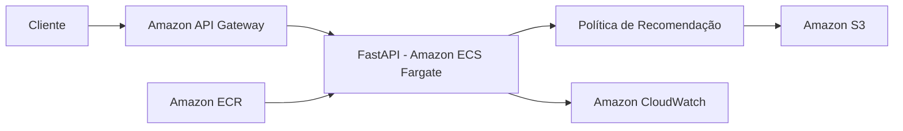

# FIAP Datathon - Machine Learning Engineering

Projeto desenvolvido para o Datathon da Pós-Tech em Machine Learning Engineering da FIAP.

## Sobre o projeto

O objetivo deste projeto é desenvolver uma solução de Machine Learning Engineering para apoiar a escolha adaptativa de ofertas em canais digitais de uma instituição financeira.

A solução utilizará uma abordagem baseada em Multi-Armed Bandit, permitindo equilibrar exploração e explotação durante a seleção de ofertas.

O algoritmo adaptativo será comparado com uma estratégia determinística utilizada como baseline.

## Estratégia

Inicialmente, será utilizado o algoritmo Thompson Sampling como política adaptativa.

A solução será desenvolvida utilizando uma base pública do Kaggle relacionada a campanhas de marketing bancário e conversão de clientes.

## Dataset

O projeto utiliza a base pública **Bank Marketing**, disponibilizada no Kaggle.

Dataset:
https://www.kaggle.com/datasets/henriqueyamahata/bank-marketing

A base contém informações relacionadas a campanhas de marketing de uma instituição bancária portuguesa e possui como variável alvo `y`, que indica se o cliente realizou ou não a assinatura de um depósito a prazo.

Foi utilizada a versão `bank-additional-full.csv`, contendo 41.188 registros.

A análise exploratória dos dados está disponível em:

`notebooks/01_eda.ipynb`

## Tecnologias

- Python
- Pandas
- NumPy
- Scikit-learn
- Jupyter Notebook
- MLflow
- FastAPI

## Estrutura do projeto

```text
data/
    raw/
    processed/
```

## Execução local

Crie um ambiente virtual:

```bash
python -m venv .venv

notebooks/
src/
tests/
models/
```

## Arquitetura-alvo em nuvem

Para uma possível disponibilização da solução em produção, a arquitetura proposta utiliza serviços da AWS.

A API desenvolvida com FastAPI poderia ser empacotada em uma imagem Docker e armazenada no Amazon ECR. A aplicação seria executada utilizando Amazon ECS com Fargate, permitindo executar o serviço sem a necessidade de gerenciar diretamente servidores ou máquinas virtuais. O Amazon API Gateway poderia ser utilizado como ponto de entrada para as requisições externas, encaminhando as solicitações para a API responsável pela recomendação do canal de contato.

Os dados processados e os artefatos necessários para inicialização da política poderiam ser armazenados no Amazon S3. Para observabilidade, o Amazon CloudWatch seria utilizado para centralizar logs e acompanhar métricas da aplicação, como quantidade de requisições, erros e tempo de resposta. Essa arquitetura permite que a solução atual evolua de uma execução local para um serviço escalável e monitorável em nuvem.

### Visão da arquitetura


